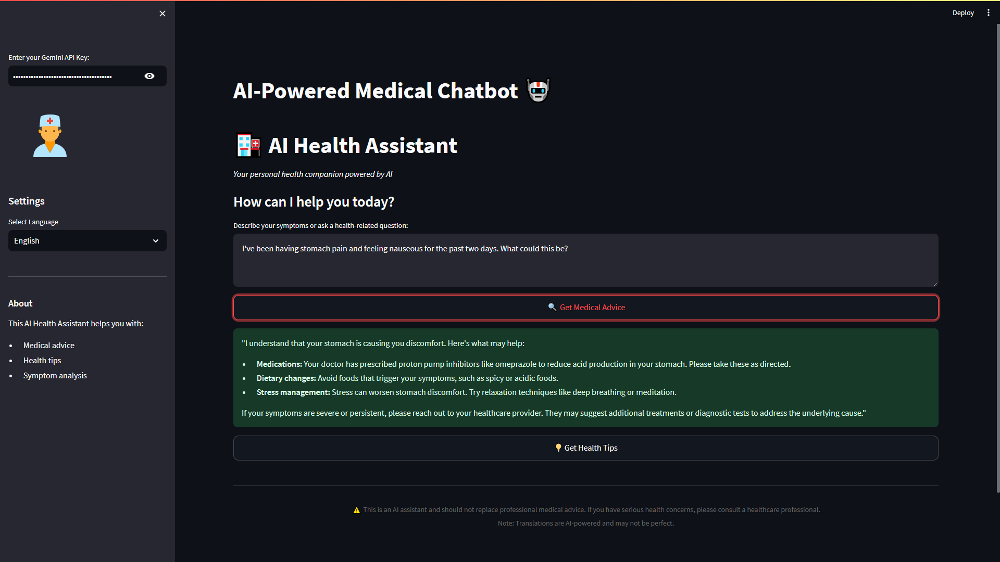
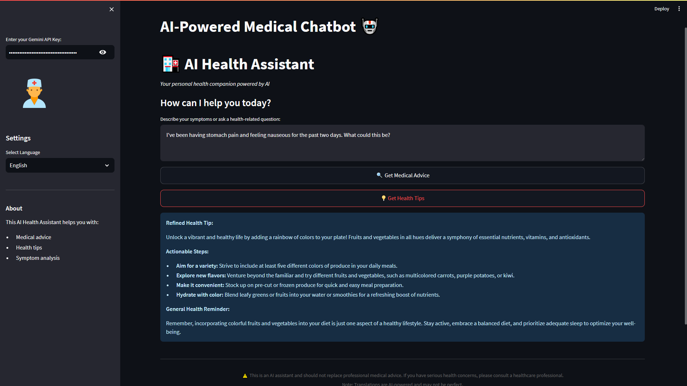

# 🏥 AI Health Assistant

  
*Your personal health companion powered by AI.*

---

## 📝 Description

The **AI Health Assistant** is a Streamlit-based web application that provides medical advice, health tips, and symptom analysis using **Natural Language Processing (NLP)** and **Google's Gemini AI**. It is designed to help users get quick, accurate, and empathetic health-related responses in multiple languages.

### Key Features:
- **Medical Advice**: Analyze symptoms and provide actionable recommendations.
- **Health Tips**: Offer personalized health tips based on user input.
- **Multilingual Support**: Supports 13+ languages for global accessibility.
- **AI-Powered Refinement**: Uses Gemini AI to enhance the clarity and empathy of responses.

---

## 🖼️ Example Test Case

  
*Response from Get Medical Advice*


*Response from Get Health Tips*

## 🚀 How It Works

1. **Input Your Query**: Describe your symptoms or ask a health-related question.
2. **Choose Functionality**: Select between **Get Medical Advice** or **Get Health Tips**.
3. **Get Refined Responses**: The app uses NLP for initial analysis and Gemini AI to refine the response for better clarity and empathy.
4. **Multilingual Support**: Responses are translated into your preferred language.

---

## 🛠️ Setup

### Prerequisites
- Python 3.8+
- Streamlit
- Google Generative AI (`google-generativeai`)
- Sentence Transformers (`sentence-transformers`)
- Googletrans (`googletrans`)

### Installation
1. Clone the repository:
   ```bash
   git clone https://github.com/rameshchandra8520/ai-health-assistant.git
   cd ai-health-assistant
   ```
2. **Create and activate a virtual environment:**
   - **On Windows:**
     ```bash
     python -m venv venv
     .\venv\Scripts\activate
     ```
   - **On macOS/Linux:**
     ```bash
     python -m venv venv
     source venv/bin/activate
     ```
3. Install dependencies:
   ```bash
   pip install -r requirements.txt
   ```
4. Run the app:
   ```bash
   streamlit run app.py
   ```

---